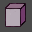

# Table of Contents

[Toolbar](#toolbar)

[Quick Key Guide](#quick-key-guide)

* [Global Keys](#global-keys)
* [2D / 3D Object Keys](#2d--3d-object-keys)
* [Particle Keys](#particle-keys)
* [Light Keys](#light-keys)
* [Height Keys](#height-keys)
* [Tile Keys](#tile-keys)

## Toolbar:

 Mode Tile

 Mode 2D

 Mode 3D

 Mode Particles

 Mode Eye Candy [1](#footnotes)

 Mode Light

 Mode Height

 Mode Map

 Select

 Clone

 New Object

 Kill

 Save Map

 Open Map

 New Map

## Quick Key Guide

### Global keys:

**Note:** *These keys are CASE SENSITIVE- so make sure you have your caps OFF!*

- **Escape**
  - Quits the program, no confirmation, no save.
- **Alt + s**
  - Turns the shadows on/off. Default is off.
- **F1**
  - Increases the time of the day with one minute.
- **F2**
  - Decreases the time of the day with one minute.
- **F12**
  - Puts you at the MAX zoom for the actual game.
- **Arrow keys**
  - Move the camera.
- **Home / End**
  - Rotate the camera.
- **Page Up / Page Down**
  - Zooms in/out
- **Shift + Home / End**
  - Rotates the camera more slowly for greater accuracy.
- **Right click a *"mode"*** -disables/enables that mode.
- **g**
  - turns a grid on/off.Press + or - on the Numpad to higher & lower the grid.
- **m**
  - minimap mode. Press m, then just left click to take yourself to any spot on the map you want.
- **n**
  - night, sets the time to the darkest part of the night.
- **d**
  - day, sets the time to the lightest part of the day.
- **o**
  - top down view
- **t**
  - Show / Hide tooltips
- **Ctrl + r** - Replace mode
  - Using this function you can take a groundtile, 2d, 3d object, or particle and globally replace it with another(all the occurances of that specific object in the entire map). Mode 1 is for ground tiles, Mode 2 is 2d objects, Mode 3 is 3d objects, Mode 4 is particles. To use this function, you must first choose which mode you want to be in, then click to pick up the object you want to replace. With the object still under your mouse cursor, press the Select button next to the word "original", and a number will show up. Then, release that object and pick up the object you want to replace it with and press the Select button next to "New". Then, hit the Replace button.
- **Ctrl + e** - Alternate edit mode
  - Using this function you can edit the attributes of an object without picking up the object with the mouse. First press ctrl+e, a blank window box will appear. Next, click the icon-mode of the object you want to edit. Then ALT+leftclick on the object. The attributes will appear in the window-box, which you can edit. Left click on the + or - box to advance the attribute numbers by 1. Holding down ctrl while clicking will make it advance by 100, holding alt will advance it by 10, shift will advance it by 0.10, and alt+shift by 0.01.

### 2D / 3D Object Keys
- **Ctrl + b**
  - Opens the 3D object thumbnail browser.
- **Ctrl + arrow keys**
  - Rotates the object on X and Z axis
- **Ctrl + Page Up / Page Down**
  - Rotates the object on the Y axis
- **Insert / Delete**
  - Move the object up/down by 10cm
- **Shift + Insert / Delete**
  - Move the object up/down by 1cm(for more accuracy)
- **Right click**
  - When you have an object selected, right clicking will delete it
- **Ctrl + w**
  - You can enable some random rotation & height settings for 3D objects.
- **Ctrl**
  - Hold this down when placing 3D objects to "stick" them to the mouse
- **Alt**
  - Hold this down when placing 2D objects and they will randomly rotate and change heights.

### Particle Keys
- **Ctrl + p** - Open particle editor
- **On ANY + or - button you can**:
  - Click with mouse alone go up increments of 0.01
  - Click with mouse AND hold down shift: increments of 0.10
  - Click with mouse AND hold down ctrl: increments of 1.0
- **Shift + Right click** - On Particle mode icon will turn on/off the black boxes

### Light Keys
- **Insert / Delete** - (same as functions as mentioned above)
- **1, 2, 3** - Increase RGB values
- **Alt + 1/2/3** - Decrease RGB values

### Height Keys
- **Tab** - Shows the Height in "3d" mode
- **Ctrl** - Puts down 9 squares instead of one.(while you have a square selected)
- **Alt** - Puts down 49 squares
- **Alt + ctrl** - Puts down 121 squares
- **Shift + clicking** - When a height map tile is under your mouse cursor this acts as a "paint bucket fill".

### Tile Keys
**Note:** *you CANNOT rotate, or adjust the height of a tile*

Putting many tiles down at once:

- first, select a tile you want to put down
- Then, without deselecting that tile, go into the minimap mode
- Then, hold down the right mouse button, and you can "draw" the tiles
  
This also works in the regular map mode.

---

###### Footnotes
1 Functionality under review